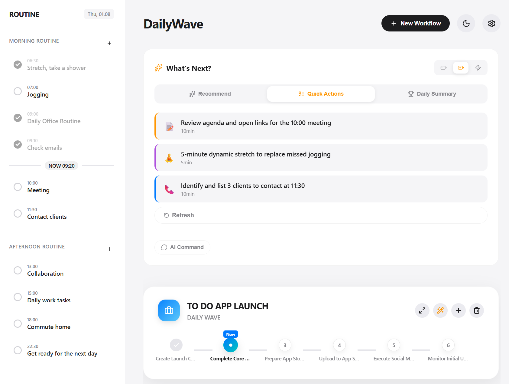

# 🌊 DailyWave

[](https://www.apache.org/licenses/LICENSE-2.0)
[](https://github.com/kks0488/dailywave)
[](https://reactjs.org/)
[](https://fastapi.tiangolo.com/)

> **"One clear next step. Then the next."**

DailyWave is an ADHD-friendly flow planner that turns messy to-do lists into a calm, guided sequence.
It recommends one task you can start now, shows only the next step, and blends routines with projects in a
single focused view.

[**🚀 Try it live (https://dailywave.vercel.app/)**](https://dailywave.vercel.app/)
Deployment status: Live on Vercel (https://dailywave.vercel.app/)

## Screenshot



## What you will see in 60 seconds

1. See **one clear next step** (local-first, optional AI).
2. Use **Chaos Dump** to capture everything (save anytime).
3. (Optional) Use AI to organize chaos into structured workflows/routines.
4. Sync across devices after signing in (Supabase Cloud).

## Screenshot links

- Landing page: `https://dailywave.vercel.app/?landing=1`

## Key features

- **One clear next step** (local-first, optional AI)
- **Simple Mode (default)**: fewer buttons, Chaos Dump-centric home
- **"What's Next?" AI (Gemini, optional)** for energy-aware recommendations
- **memU Integration (optional)** for personalized AI context from past behavior
- **Time Buddy** visual countdown timer that makes time feel real
- **Flow-based workflows** with clear next-step logic
- **Drag-and-drop** workflows and steps
- **Daily routines** alongside projects in one timeline
- **Live calendar sync** via standard `.ics` feeds
- **Multi-language UI** (EN/DE/KR/JA/ZH) and dark mode
- **Supabase cloud sync** for logged-in users (guest mode also supported)
- **Auto-save** so progress never disappears

> Auth providers: The UI is **Google-only by default**. You can enable Apple/GitHub in the login modal via `VITE_AUTH_PROVIDERS`.

## How it works

1. Create nodes for tasks or routines.
2. Connect nodes into a flow that defines order.
3. The engine finds the next actionable step.
4. Progress updates instantly and syncs to calendar feeds.

## Quick start

### Docker (recommended)

```bash
git clone https://github.com/kkaemo/dailywave.git
cd dailywave
docker-compose up -d
```

- Web UI: `http://localhost:3020`
- API docs: `http://localhost:8020/docs`

### Local development

#### Backend (FastAPI)
```bash
cd backend
python -m venv venv
source venv/bin/activate  # Windows: venv\Scripts\activate
pip install -r requirements.txt
uvicorn main:app --host 0.0.0.0 --port 8020 --reload
```

#### Frontend (React + Vite)
```bash
cd frontend
npm install
cp .env.example .env  # Optional: add your Gemini API key
npm run dev
```

Default dev URL: `http://localhost:3005` (see `frontend/vite.config.js`)

### Production (PM2)

```bash
npm install pm2 -g
pm2 start ecosystem.config.js
```

## Tech stack

### Frontend
- **React 18** + **Vite**
- **Zustand** for state
- **Lucide React** icons
- **Modern CSS** with glassmorphism-inspired UI

### Backend
- **FastAPI** for async APIs
- **Pydantic** for validation
- **iCalendar** for `.ics` feeds
- **httpx** for async HTTP (AI proxy, memU)

### Services (optional)
- **memU** for AI memory and personalization
- **Supabase** for auth and cloud sync

### DevOps
- **Docker** for local/production parity
- **PM2** for process management

## API overview

| Endpoint | Method | Description |
| :--- | :---: | :--- |
| `/` | `GET` | Health check & version |
| `/health` | `GET` | Health status |
| `/api/persistence/load` | `GET` | Load saved state |
| `/api/persistence/save` | `POST` | Save app state |
| `/api/calendar/feed` | `GET` | `.ics` calendar feed |
| `/execute` | `POST` | Run a workflow pipeline |
| `/api/ai/ask` | `POST` | AI proxy (Gemini + memU context) |
| `/api/memory/track` | `POST` | Track user behavior for memU |

For full API documentation, see [`docs/API.md`](docs/API.md).

## Project structure

```text
dailywave/
├── frontend/             # React + Vite application
│   ├── src/
│   │   ├── components/   # UI components
│   │   ├── store/        # Zustand stores
│   │   ├── lib/          # Utilities (gemini, supabase, memoryTracker)
│   │   └── locales/      # i18n translations (en/ko/ja/zh)
│   └── public/           # Static assets
├── backend/              # FastAPI application
│   ├── main.py           # App entry point
│   ├── executor.py       # Workflow execution (SSRF-protected)
│   ├── storage.py        # Thread-safe JSON persistence
│   ├── ai_proxy.py       # Server-side Gemini proxy
│   ├── memory_service.py # memU integration
│   ├── auth.py           # API key middleware
│   └── data/             # Persistent storage
├── docs/                 # Documentation
├── docker-compose.yml    # Container orchestration (+ memU)
└── ecosystem.config.js   # PM2 config
```

## Internationalization

- 🇺🇸 English
- 🇩🇪 Deutsch
- 🇰🇷 Korean
- 🇯🇵 Japanese
- 🇨🇳 Chinese

## Documentation

- [Architecture Overview](docs/ARCHITECTURE.md) - System design and data flow
- [API Reference](docs/API.md) - Complete API documentation
- [Supabase Setup](docs/SUPABASE_SETUP.md) - Auth and cloud sync setup
- [Status (2026-01-30)](docs/STATUS_2026-01-30.md) - Recent changes + setup checklist
- [Deployment Guide](deployment_guide.md) - Ubuntu/Docker/PM2 deployment
- [Roadmap](docs/ROADMAP.md) - Current status and future plans
- [Creative Features](docs/CREATIVE_FEATURES.md) - Next-gen feature blueprints
- [Changelog](CHANGELOG.md) - Version history
- [Contributing](CONTRIBUTING.md) - How to contribute

## Contributing

1. Fork the project
2. Create a feature branch (`git checkout -b feature/AmazingFeature`)
3. Commit your changes (`git commit -m "Add some AmazingFeature"`)
4. Push to the branch (`git push origin feature/AmazingFeature`)
5. Open a pull request

## Open Source & Future Plans

DailyWave is a **personal, open-source project** created to explore a more humane,
ADHD-friendly approach to productivity and daily workflows.

The core application is fully open source and can be freely **self-hosted, modified,
and extended** under the terms of the Apache-2.0 License.

If there is sufficient interest in the future, **optional hosted services or premium
features** (such as cloud sync, enhanced AI recommendations, or mobile integrations)
may be offered. These would always remain **optional**, and self-hosting will continue
to be supported.

This project is developed and maintained by an individual in their spare time.
As such, there are **no guarantees or commercial commitments**, but feedback,
ideas, and contributions are always welcome ❤️

## Trademark Notice

“DailyWave” and the DailyWave logo are **trademarks of the original author**.

You are free to fork and modify this project under the Apache-2.0 License,
but you may not use the “DailyWave” name or branding to promote derived
products or services without explicit permission.

## License

Distributed under the Apache-2.0 License. See `LICENSE` for details.

---

<p align="center">
  Built with ❤️ by <a href="https://github.com/kkaemo">kkaemo</a>
</p>
